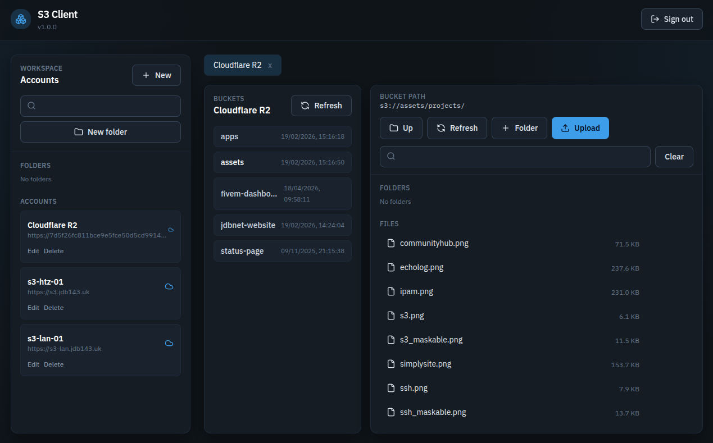

<div align="center">
  
  
  # S3 Client

A Flask + Vue app for managing S3 and S3-compatible storage with credentials stored in MariaDB.

</div>

## Features

- Encrypted credential storage in MariaDB
- Folder-based organisation of S3 accounts
- Bucket discovery and object browser
- Upload, download, rename, delete, and folder creation for objects
- Vue + Tailwind UI

## Docker Compose

```yaml
services:
  app:
    image: cr.jdbnet.co.uk/public/s3-client:latest
    ports:
      - "5000:5000"
    environment:
      SECRET_KEY: "<YOUR_SECRETKEY>"
      SESSION_DAYS: "14"
      SESSION_COOKIE_SECURE: "false" # True if using HTTPS
      WEBAPP_USERNAME: "<YOUR_USERNAME>"
      WEBAPP_PASSWORD: "<YOUR_PASSWORD>"
      DB_ENCRYPTION_KEY: "<YOUR_ENCRYPTION_KEY>"
      MYSQL_HOST: "<YOUR_MYSQL_HOST>"
      MYSQL_PORT: "<YOUR_MYSQL_PORT>"
      MYSQL_DATABASE: "<YOUR_MYSQL_DB>"
      MYSQL_USER: "<YOUR_MYSQL_USER>"
      MYSQL_PASSWORD: "<YOUR_MYSQL_PASSWORD>"
    restart: unless-stopped
```

<hr>

